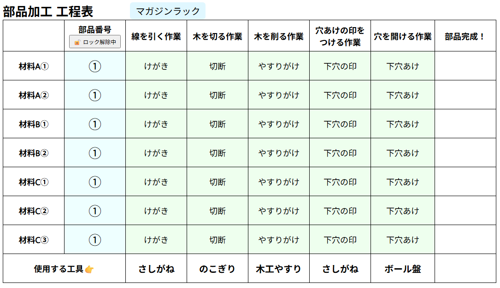

# 部品加工 工程表 🛠️

中学校技術科の木材加工で使える、**部品ごとの進捗を記録するWebアプリ**です。  
HTML＋JavaScriptだけで構成されており、インタラクティブに進捗管理ができます。

 <!-- スクリーンショット画像は任意で配置 -->

---

## 🔗 公開ページ

📌 GitHub Pages で公開中：  
👉 [https://keigox68000.github.io/buhintracker/](https://keigox68000.github.io/buhintracker/)

---

## 📋 このアプリでできること

- 各部品の作業進捗（けがき／切断／やすりがけ／下穴印／下穴あけ）をクリックで記録
- 作業完了時には「完成！」と表示される
- 部品番号を1〜5から選択できる（ロック機能あり）
- **ローカルストレージ**に自動保存され、次回アクセス時に状態を復元
- Chromebook や タブレット でも使用可能

---

## 🛠️ 技術構成

- HTML / CSS / JavaScript（**フレームワーク未使用**）
- オフライン動作対応（CDN非使用）
- GitHub Pages にて公開
- 保存形式：ブラウザのローカルストレージ（`localStorage`）を利用しています。
  - データは端末内に保存され、サーバーには送信されません。
  - 同一ブラウザ上でのみ保存状態が維持されます。

---

## 📁 ファイル構成

buhintracker/
├── buhin.html              # メインアプリ（部品加工の進捗記録表）  
├── index.html              # GitHub Pages 用のトップページ  
├── README.md               # この説明ファイル  
├── LICENSE                 # MITライセンス（再利用条件の明記）  
└── docs/                   # 説明用のスクリーンショットなど  
    └── buhin.png  

※ `index.html` は GitHub Pages のトップページとして使用されます（アプリ本体ではありません）。

---

## 📄 ライセンス

このプロジェクトは [MITライセンス](LICENSE) のもとで公開されています。  
自由に利用・改変していただいて構いませんが、著作権表示は残してください。
